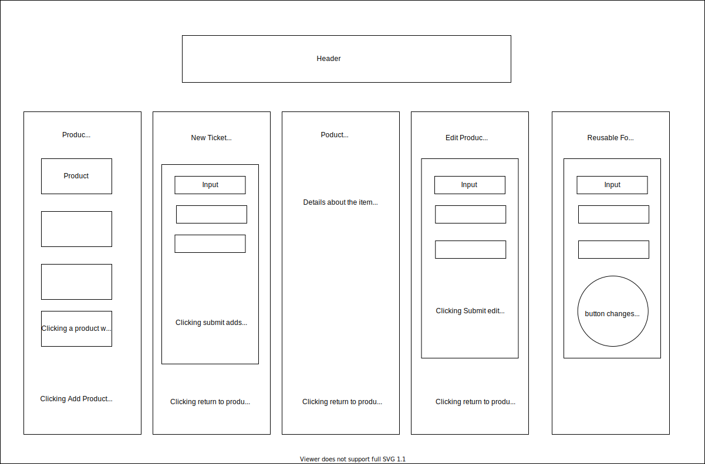

# Tap House

#### By Reid Ashwill 

## Description
A project made to practice React fundamentals.  It gives the user full CRUD functionality over kegs that are available at a tap house.

## Specs

## User Stories

As a user, I want to see a list/menu of all available kegs. For each keg, I want to see its name, brand, price and alcoholContent.

As a user, I want to submit a form to add a new keg to a list.

As a user, I want to be able to click on a keg to see its detail page.

As a user, I want to see how many pints are left in a keg.

As a user, I want to be able to click a button next to a keg whenever I sell a pint of it. This should decrease the number of pints left by 1. Pints should not be able to go below 0.

## Setup/Installation Requirements
* _Navigate to https://github.com/reidashwill/week_17_project_
* _clone the respository to your local machine_
* _navigate to the cloned directory and open in your text editor of choice to view code_

* _from the terminal inside the cloned project directory, run the command: npm install._
* _run the command: npm run start to start a live server on your local machine_
* _In your browser of choice, navigate to localhost:3000_

* _see it desployed live at https://tap-house.herokuapp.com/_
## Known Bugs
No known bugs at this time

## Technologies Used

* _JavaScript_
* _React_
* _Redux_
* _PropTypes library_
* _CSS_
* _Ant Design_

### License

*Licensed under the MIT license*

Copyright (c) 2020 **_Reid Ashwill_**